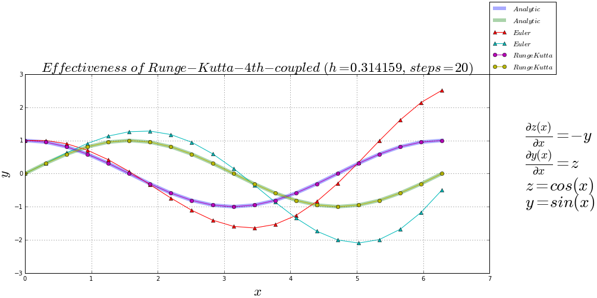
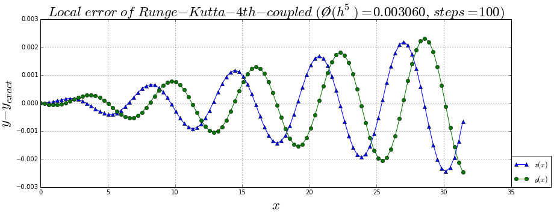

## Epidemiological models

### [simple single strain SIR epidemiological model](http://nbviewer.ipython.org/github/alvason/infectious-pulse/blob/master/sir/sir.ipynb)

### [many-strain SIR model with mutation](http://nbviewer.ipython.org/github/alvason/infectious-pulse/blob/master/sir-array/sir_array_mutation.ipynb)

### [many-strain SIR model with mutation and immunity](http://nbviewer.ipython.org/github/alvason/infectious-pulse/blob/master/sir-array/sir_array_mutation_immunity_event.ipynb)

### [many-strain SIR model with mutation and immunity](http://nbviewer.ipython.org/github/alvason/infectious-pulse/blob/master/sir-array/sir_array_immunity.ipynb)

## Numerical computation

### [estimation of the Runge-Kutta-4th numerical algorithm (fixed-step) for a list of coupled differential equations](http://nbviewer.ipython.org/github/alvason/infectious-pulse/blob/master/sir/runge_kutta.ipynb)

