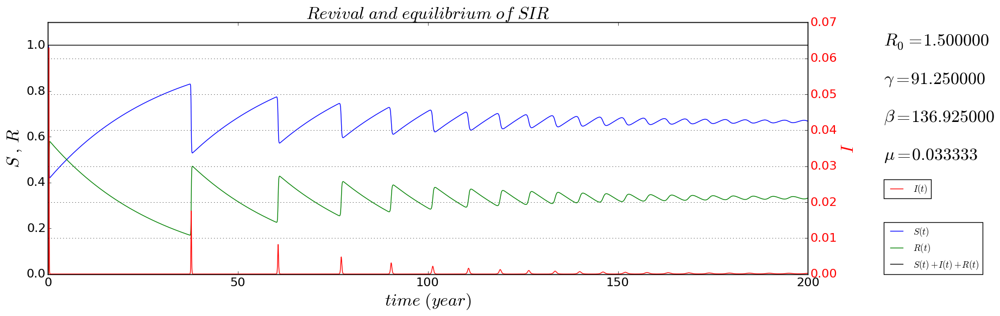
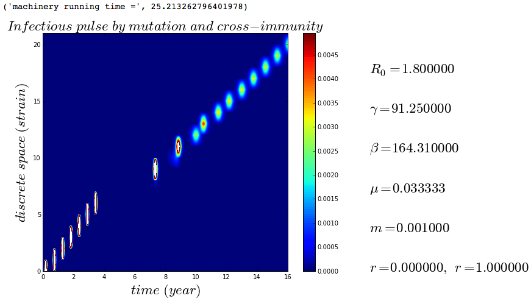
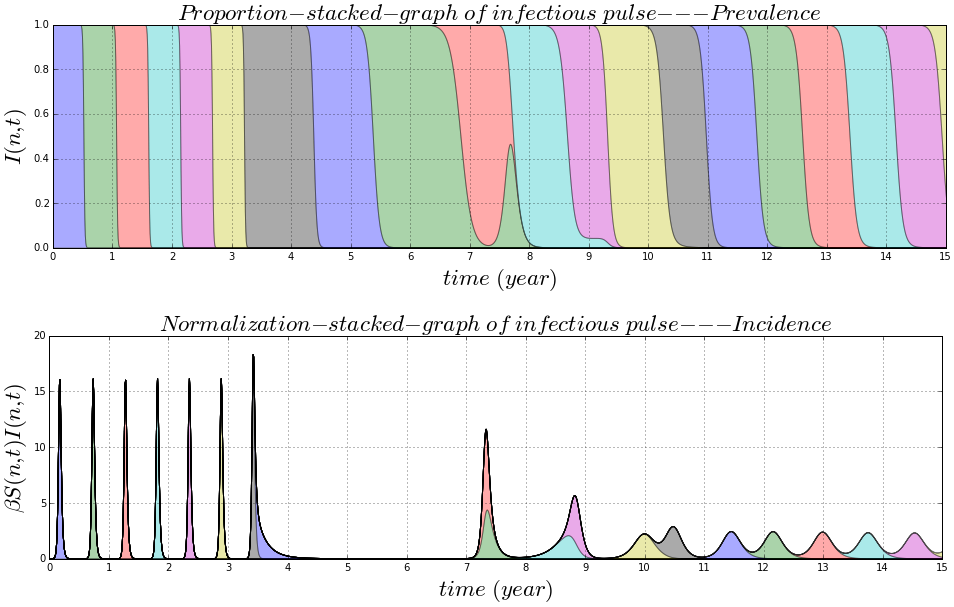
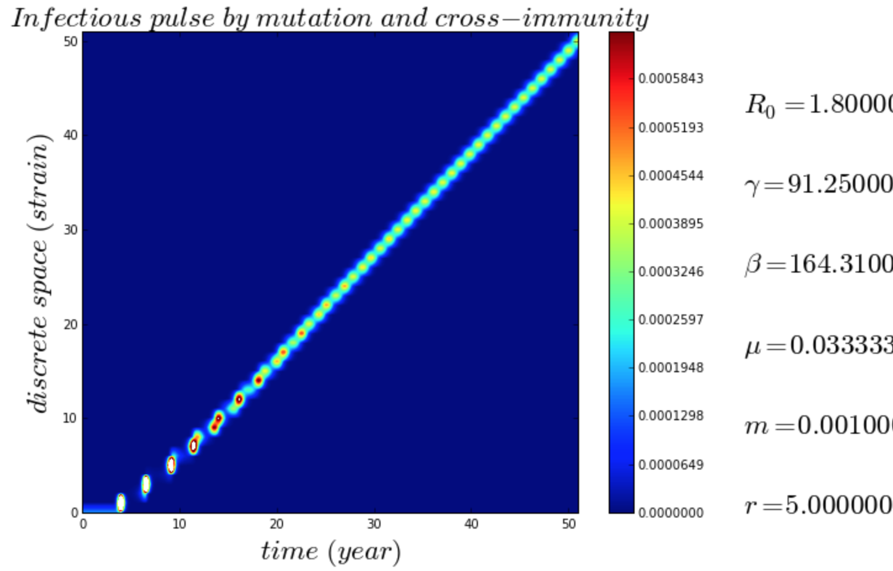

## Epidemiological models

### [one strain SIR epidemiological model](https://github.com/alvason/infectious-pulse/blob/master/code/sir.ipynb)

### [many-strain SIR model with mutation](https://github.com/alvason/infectious-pulse/blob/master/code/sir_array_mutation.ipynb)

### [many-strain SIR model with mutation and immunity](https://github.com/alvason/infectious-pulse/blob/master/code/sir_array_mutation_immunity_event.ipynb)

### [many-strain SIR model with mutation and immunity](https://github.com/alvason/infectious-pulse/blob/master/code/sir_array_immunity.ipynb)

